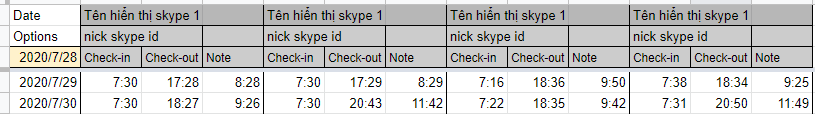
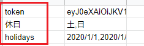
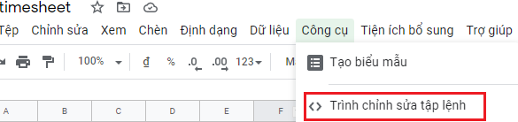
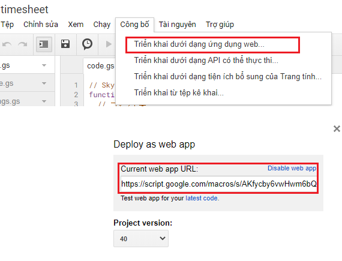

## Chatbot này là gì?
Bot cho skype viết bằng google script, lưu trong google sheet.
Dùng để điểm danh và quản lý thời gian nghỉ của team

## Hội thoại cơ bản
1. Checkin:  @OutOfBox おはよう|hi|hello|morning|出勤
2. Checkout: @OutOfBox bye|night|お疲れ
3. Đăng ký nghỉ
   - Hôm nay: @OutOfBox off / @OutOfBox off today
   - Ngày mai: @OutOfBox off tomorrow
   - Ngày khác: @OutOfBox off yyyy/M/D
4. Hủy đăng ký nghỉ
   - Hôm nay: @OutOfBox cancel off / @OutOfBox cancel off today
   - Ngày mai: @OutOfBox cancel off tomorrow
   - Ngày khác: @OutOfBox cancel off yyyy/M/D
5. Khác
   - Hiện hội thoại cơ bản: @OutOfBox help|command
   - Nhiều tính năng nâng cao khác...

## Hướng dẫn
### 1. Tạo google sheet
- Tạo google sheet với tên bất kỳ, ví dụ là **timesheet**
- Tạo 2 sheet: 1 sheet là **worktimes**, 1 sheet là **settings** với nội dung lần lượt như hình

- Vào menu **Công cụ** > **Trình chỉnh sửa tập lệnh**

- Chọn menu **Công bố** > **Triển khai dưới dạng ứng dụng web.**

   - Chọn phần **Who has access to the app** là **Anyone, even anonymous**
   - Bấm nút công bố và copy **Current web app URL** lưu lại

### 2. Đăng ký bot với Bot Framework
- Đăng nhập vào [Bot Framework Portal](https://dev.botframework.com/) bằng tài khoản đăng nhập của skype. Click **Register**, tiếp đó nhập **Bot profile** (Icon, Display Name, Description, Endpoint), trong đó:
  > - Icon: gì cũng đc.
  > - Display Name: tên gì cũng đc
  > - Description: tùy bạn
  > - Endpoint: là url đã lưu ở **bước 1**
  > - Bấm vào **Manage Microsoft App ID and password** để lấy **clientId**, **clientSecret** lưu lại dùng cho mục 4

- Click Manage Microsoft App ID and password để lấy App ID, tiếp đó click Generate an app password to continue để lấy App password, nhớ lưu lại ID và password này để cấu hình cho bot ở các bước sau
Cuối cùng, click Register để hoàn thành việc đăng ký bot

### 3. Cấu hình bot để kết nối với Skype
- Đăng nhập vào [Bot Framework Portal](https://dev.botframework.com/)
- Click **My bots**
- Chọn con bot mà bạn muốn config
- Click **Channels**
- Ở phần **Add channel**, chọn **Skype**, cấu hình cho kênh
- Bấm vào Tên kênh **Skype** để add bot vào contact của skype

### 4. Bắt đầu code cho bot ở google script
Bạn tạo 4 file như ở source code git hub và copy code vào.
Thay đổi **clientId**, **clientSecret**
Thiết lập trigger để chạy hằng ngày